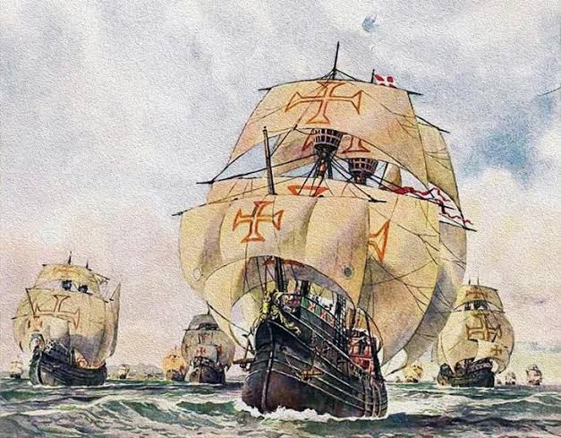

As Grandes Navegações, também conhecidas como Expansão Marítima, foram o processo de exploração e navegação do Oceano Atlântico que se iniciou no século XV e estendeu-se até o século XVI. Nesse período, os europeus descobriram novos caminhos marítimos para alcançar a Ásia. Além disso, chegaram pela primeira vez a terras até então desconhecidas por eles, como o continente americano, local ao qual chegaram em 1492.

--- 

